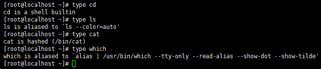

## other

初级：系统基础
中级：系统管理、服务安全及服务管理、Shell脚本
高级：
MySQL数据库：
	cache & storage
集群：
	Cluster
	
	lb:// 负载均衡集群
		4layer
		7layer
	hb:// 高可用集群
分布式：
	zookeeper
	分布式文件系统
虚拟化技术：
	xen
	kvm
Openstack: 
	IAAS云

运维工具：
	ansible
	puppet(ruby), saltstack(python)
监控工具：
	zabbix
大数据处理：
	hadoop
	spark, storm

	elk: elastcsearch, logstash, kibana
docker
	
Python

## OS

现代计算机设备的组成部分：
运算器，控制器，存储器，输入设备，输出设备
	CPU
	bus: 总线
	memory: 编址存储单元

	read ahead

IO: 与外部部件交互
	磁盘
	网卡

虚拟机：虚拟计算机
	软件 + 硬件 模拟出的虚拟设备
	
CPU: 运算器和控制器组成。
	一个CPU，就是一个芯片。	

CPU指令，指令集：
- 特权指令：OS运行特权指令
- 普通指令：应用程序语言只能调用普通指令

接近于人类阅读的语言称之为高级语言，接近于机器的称之于低级语言。
	
高级语言 -> 汇编语言（装换为芯片支持的汇编语言） -> 对机器指令的调用

> OS

OS: Operating System

- 软件程序
- 通用目的
	硬件驱动，进程管理，内存管理， 网络管理， 安全管理

System Call(Syscall)，系统调用: 应用程序向系统内核申请执行特权指令。

编程层次：
	硬件规格：hardware specification
	系统调用：
	库调用：library call，把非常多的底层功能，整合出来，提供离最终目标更近的功能。

	kernel -> lib/系统调用 -> OS

程序启动：
- 开机自动启动
- 人为启动，完成人为启动，需要有一个程序允许与计算机打交道。这个程序称之为：用户接口（UI/前端）

UI：
	GUI：Graphic User Interface 图形用户接口/图形用户界面
	GLI: Command Line Interface 命令行用户接口

在众多的接口中，有一类特殊的接口为，用户接口。
用户通过用户接口来指挥其它程序的运行。

ABI：Application Binary Interface 运行程序接口，接口格式/规范
API: Application Programming Interface 应用编程接口


CPU架构类型：

- x86 （intel）
- x64 （intel）
- arm （高通）
- m68000 -> m68k（摩托罗拉）
- power，第一个多核CPU，第一个4GHz（IBM）
- ulterasparc （Sum）
- alpha （惠普）
- 安腾


每一种CPU提供的指令集个不一样，无论怎么编译，如果只支持x86类型的，是无法运行起来。


## 操作系统

```
Windows
Linux:
	Linus --> Linux

	GNU/Linux
Unix： 
	System：AIX（IBM），Solaris（SUM）,HP-UX（HP）
	BSD：Berkeley System Distribution: NetBSD, OpenBSD, FreeBSD


MIT：
	GNU： GNU is Not Unix
	GPL：General Public License
```

计算机的基础知识：
CPU（运算器+控制器），memory，I/O（输入设置+输出设备）

程序运行模式：
	用户空间：user space, US
	内核空间：system space

运行程序格式：
	Windows: ExE, 库文件dll(dynamic link  blirary)
	Linux: ELF, 库文件so	(shared object)

程序：指令 + 数据
	指令：只读
	数据：读写
程序：算法 + 数据结构

库调用，系统调用：从本质上讲都是别人写好的程序，可以直接拿来使用。// malloc()申请内存, free()释放内存

编程语言：
- 汇编语言：维码编程(系统中与硬件相关的特有代码，驱动程序开发)
- 高级语言C,C++：系统级应用
- 高级应用java，python，php：应用程序

```
kenrel, glibc, bash --> 编译成对应的执行文件，组成系统
```

## Linux发行版

主流发行版本：
```
slackware:
	suse // 二次发行版本
		opensuse // (基于sure发行的) // 三次发行版本
		sles
debian:
	ubuntu // 二次发行版本
		mint  // 三次发行版本
redhat:
	rhel: redhat enterprise linux
	CentOS: 兼容rhel的格式 // 在后期被rhel收购，rhel维护二个分支.
	fedora
ArchLinux: 完全独立，轻量，轻巧的程序独立包
Gentoo
LFS：Linux From scratch

Android: kernel + busybox + java虚拟机
```

程序包管理器:

- rpm: RHEL, Fedora, S.u.S.E, CentOS
- dpt: Debian, Ubuntu


CentOS和Linux关系?
CentOS和RHEL是什么关系?
各种开源协议的具体细节：GPL, LGPL, Apache, BSD

> 自由软件

- 自由使用
- 自由学习和修改
- 自由分发
- 自由创建衍生版

> Linux的哲学思想

1. 一切皆文件：把几乎所有的资源，包括硬件设备都组织为文件格式.
2. 由众多单一目的的小程序组成，一个程序只实现一个功能，而且要做好。
3. 尽量避免跟用户交互。目标：实现脚本编程，以自动完成某些功能.
4. 使用纯文本文件保存配置信息。目标：一款使用的文本编辑器即能完成系统配置工作。

获取CentOS的发行版：

(aliyun镜像)[http://mirrors.aliyun.com]
(sohu镜像)[http://mirrors.sohu.com]
(163镜像)[http://mirrors.163.com]

```
startx & // 开启桌面模式
```
-----

```
application
		↑
  library
		↑
 kernel （系统调用：操作系统将硬件抽象出来）
		↑
 hardware（硬件）
```

> 终端

服务器只有网线和电源线，并没有键盘，鼠标，显示器之类的输出设备，不妨碍向外面提供服务。为了系统能够执行配置，可以远程连接，必须需要有一个交互式接口，这个接口程序可能在vda输出，也有可能远程输出到远程终端上。

用户与主机交互，必然要用到设备，称之为：终端设备


大型主机上有一个分屏器，分屏器中的端口或者端子可以接入一个键盘和显示器。
用户键盘+显示器：终端

终端的多种类型：

- 物理终端：本机接入本机的显示器，键盘设备。（从一定程度上讲物理终端也称之为控制台console）设备文件路径：`/dev/console`
- 虚拟终端：附加在物理终端之上的以软件方式虚拟的终端。CentOS默认有6个虚拟终端，使用快捷键`Ctrl + Alt + F1~F6`。设备文件路径：`/dev/tty1~6`
- 图形终端：附加在物理终端之上的以软件方式实现的终端，额外会提供桌面环境（图形终端也是虚拟终端的一种）。
- 模拟终端：图形界面下打开的命令行接口，基于`ssh`协议或`telnet`协议等远程打开的界面。设备文件路径：`/dev/pts/# [0,∞)`

一般来讲系统启动之后，默认使用虚拟终端1登录，而不会使用物理终端，即便在屋里设备上。
刚开机的时候，程序还未运行起来，所有的信息需要输出，这个时候映射的是物理终端，一旦程序启动完成了，默认使用`虚拟终端1`进行用户登录界面。如果默认启动的是图形界面，也会启动`图形终端`。

查看当前的终端设备命令：`tty`
```
/dev/pts/l // 模拟终端
/dev/pts/0 // 图形终端
/dev/tty2 // 虚拟终端2
```

交互式接口：启动终端后，在终端设备附加一个交互式应用程序。
```
GUI: 图形交互程序，会使用到窗口管理器`X protocol -> window manager, desktap`
	Desktap: GNOME(C, 图形开发库：gtk)，KDE(C++, 图形开发库：qt)，XFCE（轻量级桌面）
CLI: 文本界面
	shell程序:
		sh (bourn)
		csh (C语言类似的shell程序)
		tcsh (csh升级版)
		ksh (korn开发的)
		bash (bourn again shell, 开源组织综合其它sh优点开发的shell),遵循GPL协议
		zsh (功能更加强大)
```

显示当前使用`shell`：
```
echo $SHELL
```
显示当前系统使用所有的`shell`
```
cat /etc/shells
```

> 命令

命令提示符：`prompt`
```
[root@localhost ~]#
[admin@localhost ~]$


echo $PS1
	[admin@localhost ~]
	[\u@\h \W]\$

prompt:
管理员：#
普通用户：$
```

命令：
输入命令，回车：提请shell程序找到键入命令所对应的可执行程序或代码，并由分析后提交给内核分配资源将其运行起来，表现为一个或多个进程（运行中的程序称之为进程）。

在`shell`中可执行的命令有两类：
- 内建命令：由`shell`自带的，而且通过某命令形式提供
- 外部命令：在当前系统的某文件系统路径下有对应的可执行程序文件

查找某个外部命令
```
which ls
whereis ls
```

区别外部或内部命令：
```
type cd
```



运行命令：
命令格式，`COMMAND [OPTIONS...] [ARGUMENTS...]`
选项：用户启用或关闭命令的某个或某些功能。短选项：`-c`,例如：`-l, -h,`(大多数情况下多个短选项可合写) 长选项：`--word`,例如:`--long`,`--human-readable`

参数：命令的作用对象。向命令提供数据，

多个选项，多个参数之间都应该要空格隔开。

取消命令执行：`Ctrl + C`


> 文件系统

一个定位系统，需要有一个起始位置

`Linux`是倒置树文件系统

文件数据:
- 元数据：metadata
- 数据：data


`Linux`文件系统特点：
- 文件名严格区分字符大小写
- 文件名可以使用除了`/`以外的任意字符(不建议使用特殊字符)：`/根目录`，`路径分隔符`
- 文件名长度最长不能超过255个字符串
- 所有`.`开头的文件，都是隐藏文件
 directory

路径：
- 绝对路径：从根目录起始的路径
- 相对路径：对当位置其实的路径。当前目录(current)/工作目录(working directory)

```
>pwd  // printing working directory
```

LSB: Linux Standard Base （linxu定义），规定了linux基本的规范。

## 命令

> Linux命令帮助的获取

外部命令：都有一个可执行程序，位于文件系统某目录下。

`shell`程序搜寻可执行程序文件的路径定义在`PATH`环境变量中。
```
echo $PATH
// 自左至右顺序寻找
/usr/local/bin:/bin:/usr/bin:/usr/local/sbin:/usr/sbin:/sbin:/home/admin/bin
```

内部命令获取帮助：`help COMMAND`
外部命令：
- `COMMAND --help`
- `COMMAND -h`
- 使用手册`manual`,`man COMMAND`
- 信息页`info COMMAND`
- 程序自身的帮助文档`README`,`INSTALL`,`ChangeLog`: `/usr/share/doc/COMMAND_VERSION`,`/usr/share/doc/httpd-2.2.15/`
- 程序官方文档：官方站点`Documentation`
- 发行版的官方文档
- Google: `openstack filetype:pdf`,`openstack site:openstack.com`
- www.slideshare.net

```
> hash
```

shell搜寻到的外部命令的路径结果会缓存至kv(key-value)存储中。
输入的命令第一次会在各自可执行程序文件中寻找，然后存储在缓存中（可理解为内存中的一段空间），后续使用中，从缓存中查找。


```
> history
> history -a // 手动追加本次会话新执行的命令历史列表至历史文件中
> history -c // 清空命令历史
```
管理命令历史
登录系统之后，输入的每一个命令都记录在历史记录缓冲当中，一旦登出（`exit`,`logout`）之后会放置在历史文件`.bash_history`中。
登录`shell`时，会读取命令历史文件中记录下的命令:`~/.bash_shitory`


快捷操作:
```
> !# // !7 // 调用历史记录中第#条命令
> !string // !man // 调用历史记录中最近一个以string开头的命令
> !! // 重复运行上一条命令
```

CentOS系统中，手册页:`/usr/share/man`
`man1 ... man8`
系统之上有很多命令，有些命令出于管理的目的，有点普通用法目的。不同目的，不同权限的的命令，一般是分门别类进行存放。
```
> man COMMAND
> man read
> man 2 read // 查看指定章节的帮助手册
> whatis COMMAND
> whatis read // 查看那些章节下有相关文档
```
- man1: 用户命令
- man2: 系统调用
- man3: C库调用(系统库)
- man4: 设备文件（`/dev`底下的文件）及特殊文件
- man5: 配置文件格式
- man6: 游戏
- man7: 杂项
- man8: 管理类的命令

`man`命令的配置文件：`/etc/man.config`
`MANPATH`变量定义`man`命令到哪边搜索文件路径

```
nano /ect/man.confg // 编辑器
```

帮助手册说明：
SYNOPSIS:
```
[]: 可选内容
<>: 必选内容
a|b: 二选一
...: 同一内容可出现多次
```

`man`命令的操作方法（解压`gzip`文件，然后内部调用less命令，进行显示）：
```
Space(空格)，Ctrl + f, Ctrl + V, Ctrl + F： 翻屏操作
b, Ctrl + B： 向文件首部翻屏
d, Ctrl + D： 向文件尾部翻半屏
u, Ctrl + U： 向文件首部翻半屏
q： 退出
1G： 调至文件首部
G： 调至文件尾部
10： 跳转10行（键入数字）
/keyword： 搜索关键字，（以keyword指定的字符串为关键字，从当前位置向文件尾部搜索，默认不区分大小写）
n: 下一个关键词
N: 上一个关键字
?keyword: 向文件头部搜索
```

## 基础命令


Linux的两种时钟：
- 系统时钟：由Linux内核通过CPU的工作频率进行的计时操作
- 硬件时钟

```
> date 
> date +%F-%T
```
-----
```
> hwclock // 显示硬件时钟
> cal // 显示日历相关
```

> cd

当前目录或工作目录
主目录，家目录：HOME

```
root: /root
普通用户：/home/USERNAME
	/home/admin
~: 用户的主目录	
```
-----
```
cd ~ // 家目录
cd ~USERNAME // 切换到指定的用户的家目录
cd - // 在上一个目录和当前目录之间来回切换
```
相关环境变量：
`PWD`：保存了当前目录路径
`OLDPWD`：上一次所在目录路径

> pwd

显示当前目录

> ls

`ls`: `list`
显示指定路径下的文件列表

``
> ls -a // 所有文件包括隐藏文件
> ls -l // 文件详细信息格式
> ls -lh // -h 文件大小单位换算
> ls -lhd // -d 当前自己的目录的相关属性，通常要与-l一起使用
> ls -lhr // -r --reverse 反序显示
> ls -R // -R --recursive 递归显示
```

```
dr-xr-xr-x.   2 root root  4096 Dec 17 14:25 bin

dr-xr-xr-x：
最左侧的以为：文件类型
- 普通文件
d 目录文件
l 链接文件
b 跨设备
c 字符设备: character device
p 管道
s 套接字
b：block device
后九位：访问权限mode

2: 文件被硬连接的次数

root: 文件的owner(所有者)

root: 文件的group(属主)

4096: 文件的size(大小)

Dec 17 14:25: 文件最近一次被修改(文件的属性)的时间

bin: 文件名
```

> stat

获取指定文件的状态信息/元数据
```
> stat /root/install.log
```

> 文件查看命令

`cat`连接指定文件，并顺序显示内容
`tac`连接指定文件，并反着显示内容

```
> cat /etc/fstab  /etc/issue
> cat -E /etc/fstab // 显示行结束符$
> cat -n /etc/fstab // 对显示内容的行号
```

> 文件内容类型查看

```
> file /etc/fstab
````

> 回显命令

```
> echo 
> echo -n // 禁止自动添加换行符号
> echo -e // 允许使用转义符: \n:换行，\t:制表符
```

> which 

显示命令对应的程序文件路径

```
which cat
```

> whereis

显示命令的库文件，资源，man手册等信息
```
> whereis cat
```

> whatis

使用mkwhatis命令可将当前系统上的帮助手册以及与之对应的关键字创建为一个数据库。

```
> whatis read
```

> 系统管理

关机：
`halt`, `poweroff`, `shutdown`, `init 0`
重启：
`reboot`, `shutdown`, `init 6`
用户登录相关：
`who`(系统当前所有登录会话), `whoami`(显示当前登录有效用户), `w`(系统当前所有登录会话及所做的操作)


常用：`halt -f`, `reboot -f`
`-f`: 强制，不调用`shutdown`
`-p`: 切断电源
`shutdown -h 0`

## 文件系统

根文件系统（rootfs）：root filesystem
Linux的内核运行起来，会挂载系统盘，作为根文件目录。

其它分区，要与系统盘建立关联关系。系统盘的一级目录作为其他分区的根目录。

对linux来讲，都是在根目录下，为什么还要分区呢？
预防重装系统，或者对应盘符格式化情况。

系统自我运行使用到的路径（除了boot，home之外，其它目录不能关联分区）：
```
/boot： 引导文件的存放的目录（操作系统启动依赖的文件）,内核文件(vmlinuz),引导加载器（bootloader，grub）都存放此目录
/bin: 供所有用户使用的基本命令(OS启动过程中需要使用到的程序),不能关联至独立分区
/sbin: 管理类的基本命令，不能关联至独立分区，OS启动即会用到对程序(管理员才能使用)
/lib: 基本/共享库文件,以及内核模块文件（/lib/modules）
/lib64: 专用于x86_64系统上的辅助共享库文件存放位置
/etc: 配置文件目录(纯文本文件) /etc/X11/ X协议配置文件
/home: 用户家目录
/root: 管理员的家目录
/dedia: 便携式移动设备挂载点（U盘，光盘，手机）
/mnt: 临时文件系统挂载点
/dev：设备文件及特殊文件存储位置: b：block device (随机访问设备)，c：character device(线性访问设备)
/opt：第三方应用程序的安装位置，类似windows附件
/srv: 系统上运行的服务用到的数据
/tmp: 临时文件存储位置
```

一般作为独立分区/关联分区：
```
/usr: universal shared, read-only data。 （文件一般不需要修改，只读）
	bin: 保证系统拥有完整功能而提供的应用程序
	sbin: 
	lib:
	lib64:
	etc:
	include: C程序的头文件（header files）
	share: 结构化独立的数据，例如doc，man等
	local: 第三方应用程序的安装位置(自我独立的程序安装位置)：bin, sbin, lib, etc, share
/var: variable data files
	cache: 应用程序缓存数据目录
	lib: 应用程序状态信息数据
	local: 专用于为/usr/local/下的应用程序存储可变数据
	lock: 锁文件
	log: 日志目录及文件
	opt: 专用于为/opt下的应用程序存储可变数据
	run: 运行中的进程相关的数据，通常用于存储进程的pid文件
	spool: 应用程序缓冲池
	tmp: 保存系统两次重启之间产生的临时数据
/proc: 用于输出内核与进程信息相关的虚拟文件系统（伪文件系统）
/sys: 用于输出当前系统上硬件设备相关信息的虚拟系统（伪文件系统）
/selinux: serucity enhanced Linux, 安全加固机制，安全策略等信息存储位置
```

`Linux`上的应用程序组成部分：
- 二进制程序：`/bin`, `/sbin`, `/usr/bin`, `/usr/sbin`, `/usr/local/bin`, `/usr/local/sbin`
- 库文件：`lib`, `/lib64`, `/usr/lib`, `/usr/lib64`, `/usr/local/lib`, `/usr/local/lib64`
- 配置文件：`/etc`, `/ect/DIREACORY`, `/usr/local/etc`
- 帮助文件： `/user/share/man`, `/usr/share/doc`, `/usr/local/share/man`, `/usr/share/doc`

`Linux`下的文件类型：
- (f): 普通文件
- d: 目录文件
- b：块设备
- c: 字符设别
- l: 符号链接文件（软链接）
- p：管道文件
- s: 套接字文件，socket


> 目录相关命令

`cd`, `pwd`, `ls`

`mkdir`: 在当前目录创建目录
`rmdir`：删除空目录

```
mkdir -p src // 不存在的父目录也创建（递归创建目录）
```
`-p`：存在于不报错，且可自动创建所需的各目录
`-v`：显示详细信息
`-m`：创建目录时直接指定权限


> 文本文件查看命令

`cat`,`tac`

`more`
`less`
`tail`
`head`


> 文件时间戳管理工具

```
touch filename // 把三个时间戳修改为当前系统时间
```

文件：`metadata`,`data`
查看文件状态：`stat`

三个时间戳：
```
access time: 访问时间，读取文件内容
modify time: 修改时间，改变文件内容（数据）
change time: 改变时间，元数据发生改变
```

如果没有文件存在，创建一个空文件。三个时间戳都是当前时间。

```
touch -c a.txt // -c 不存在不创建
```

## 文件管理

`cp`, `mv`, `rm`

> cp拷贝

```
cp SOURCE DIRECTORY
```

`SOURCE`是文件
如果目标不存在，新建`DIRECTORY`，并将`SOURCE`中的内容填充至`DIRECTORY`中
如果目标存在：
	如果`DIRECTORY`是文件，将`SOURCE`中的内容覆盖至`DIRECTORY`中
	如果`DIRECTORY`是目录，在`DIRECTORY`下新建与原文件同名的文件，并将`SOURCE`中的内容填充至新文件中

`SOURCE`是目录
	使用选项：`-r` 递归复制
	如果`DIRECTORY`不存在，则创建指定目录，复制`SOURCE`目录中所有文件至`DIRECTORY`中
	如果`DIRECTORY`存在，`DIRECTORY`是文件，报错；如果`DIRECTORY`是目录，在目标目录下创建一个与目标目录同名的目录，并把源目录下文件复制到创建目录下。


> mv 移动文件

`mv`, `move` 移动文件
```
mv SOURCE DIRECTORY
```

常用选项：
`-i`: 交互式
`-f`：强制


> rm 删除

`rm`, `remove`，删除

常用选项：
`-i`: 交互式
`-f`：强制
`-r`：递归


> glob

`glob, globbing`

实现文件名“通配”

使用通配符：`*`, `?`, `[]`

`*`: 任意长度任意字符
`?`: 任意单个字符
`[]`: 指定范围内的任意单个字符
`[^]`: 指定范围之外的任意单个字符

专用字符集合：
```
[[:digit:]] = > [0-9] 

[:alnum:] 任意数值或字母 [:alpha:] 任意大小写字母  [:blank:]  [:cntrl:]
[:digit:] 任意数字 [:graph:]  [:lower:] 任意小写字母  [:print:]
[:punct:]标点符号  [:space:]  [:upper:] 任意大写字母 [:xdigit:]
```

> 文本处理工具

`wc`, `cut`, `sort`, `uniq`

> wc

`word count`

统计字节数，行数，字符数
```
wc -l /etc/passwd // 行数
wc -w /etc/passwd  // 字符数
```

> cut

特定字符输出
按照指定字符分割，默认以空格分隔

```
cut -d: -f1~f7 /etc/passwd // -d 指明分隔符。 -f 指明显示那些字段,有f1到f7
```

> sort

排序输出结果
默认字母表字母顺序排序
```
sort /etc/passwd
```
`-f`：忽略字符大小写
`-r`：逆序

> uniq

去重

连续且完全相同为重复
```
history | cut -d'' -f5 | sort | uniq
```
`-c`：显示每行重复出现的次数
`-d`：仅显示重复过的行

## grep

Linux上文本处理三剑客

`grep`: 文本过滤（模式：pattern）工具,`grep`,`egrep`,`fgrep`
`sed`: `stream editor`, 文本编辑工具
`awk`：Linux上的实现`gawk`, 文本报告生成器


`grep`: Global search REgular expression and Print out the line.
作用：文本搜索工具，根据用户指定"模式"对目标文本逐行进行匹配检查；打印匹配到的行

模式： 由正则表达式字符及文本字符所编写的过滤条件
REGEXP：由一类特殊字符及文本字符所编写的模式，其中有些字符不表示字面意义，而表示控制或通配的功能。


正则表达式两类：
- 基本正则表达式：BRE。`grep`
- 扩展正则表达式：ERE。 `grep -E`, `egrep`


> grep

```
grep root /etc/passwd
grep --color=auto root /etc/passwd

--color=auto：对匹配到的文本着色显示
-v: 显示不能够被pattern匹配到的行,取反
-i: 忽略字符大小字
-o：仅显示匹配到的字符串
-q：静默模式不输出任何信息

-E：使用ERE
```

基本正则表达式元字符：
- 字符匹配：
	`.`：匹配任意单个字符
	`[]`：匹配指定范围的任意单个字符
	`[^]`：匹配指定范围的任意单个字符
- 匹配次数：用在要指定次数的字符后面，用户指定前面的字符要出现的次数
	`*`: 匹配前面的字符任意次
	`.*`: 任意长度的任意字符
	`\?`：匹配其前面的字符0次或 1次，即前面字符可有可无
	`+`：匹配其前面字符至少1次
	`\{m\}`: 匹配前面的字符m次
	`\{m,n\}`: 匹配前面的字符至少m，至多n次
	`\{0,n\}`: 匹配前面的字符至多n次
	`\{m,\}`:匹配前面字符至少m次
- 位置锚定
	`^`: 行首锚定, 用户模式的最左侧
	`$`：行尾锚定，用户模式的最右侧
	`^$`: 空行
	`\<`或`\b`: 词首锚定，用户单词的左侧
	`\>`或`\b`: 词尾锚定，用户单词的右侧
- 分组
	`\(\)`: 将一个或多个字符捆绑在一起，当作一个整体进行处理

	后向引用：引用前面的组括号中 模式所匹配字符，（而非模式本身）
	Note：分组括号中的模式匹配到的内容会被正则表达式引擎记录于内部的变量中，这些变量的命名方式: `\1`(从左侧起，第一个左括号以及与之匹配右括号之间的模式所匹配到的字符),`\2`,`\3`


> egrep

扩展的正则表达式

```
grep [OPTIONS] PATTERN [FILE...]
```

扩展正则表达式元字符：
- 字符匹配
	`.`	, `[]`, `[^]`
- 次数匹配
	`*`, `?`(0或1次), `+`, `{m,n}`
- 锚定
	`^`, `$`, `\<|\b`, `\>|\b`
- 分组
	`()`


> fgrep

找给定字符

## 文件查找

在文件系统上查看符合条件的文件

```
locate(非实时查找/数据库查找)
find(实时查找)
```

> locate

依赖于事先构建的索引，索引的构建是在系统较为空闲时自动进行（周期性任务），手动更新数据库(updatedb)


索引构建过程需要遍历整个根文件系统，极消耗资源。

特点：
- 查找速度快
- 模糊查找
- 非实时查找

```
locate KEYWORD
```

> find

实时查找工具，通过遍历指定路径下的文件系统完成文件查找

特点：
- 查找速度略慢
- 精确查找
- 实时查找

```
find [OPTION]... [查找路径] [查找条件] [处理动作] 
```
查找路径：指定具体目标路径，默认为当前目录
查找条件：指定的查找标准，可以文件名，大小，类型，权限等标准进行，默认为找出路径下所有文件（没有条件）。
处理动作：对符合条件的文件做什么操作，默认输出至屏幕。


查找条件：
- 根据文件名查找
	-name "文件名"，支持使用glob （*, ?, [], [^]）
	-iname "文件名" 不区分字符大小写，支持使用glob （*, ?, [], [^]）
	-regex "PATTEN": 以PATTEN匹配整个文件路径字符串，而不仅仅是文件名称。
- 根据属主，属组查找
	-user USERNAME:查找属主为指定用户的文件。(find /tmp/ -user -root -ls)
	-group GROUPNAMEE: 查找属组为指定组的文件。
  -uid UserID: 查找属主为指定的UID号的文件。
  -gid GroupID：查找属组为指定的GID号的文件。
	-nouser: 查找没有属主的文件
	-nogroup: 查找没有属组的文件
- 根据文件类型查找
	-type TYPE: `f: 普通文件`, `d: 目录文件`, `l: 符号链接文件`, `s: 套接字文件`, `b: 块设备文件`, `c: 字符设备文件`, `p: 管道文件`
- 组合条件
	`与: -a`, `或：-o`, `非：-not, !`
	`find / \(-nouser -o -nogroup\) -ls`
- 根据文件大小查找
	-size [+|-]#UNI // find /var -size -3k -exec ls -lh {} \; // find /var -size +3k -exec ls -lh {} \; | grep 'apache'
	常用单位：k，M，G
- 根据时间戳
	"天":`-atime [+|-]#UNIT`, `-mtime [+|-]UNIT`, `ctime`
	"分钟": `-amin`, `-mmin`, `-cmin`
- 根据权限查找
	-perm [+|-]MODE // find /etc -perm 600
	MODE: 精确权限匹配
	+MODE：任何一类（u，g，o）对象的权限中只要能一位匹配即可。
	-MODE：每一类对象都必须同时拥有为其指定的权限标准。


处理动作:
`-print`: 默认 处理动作，显示至屏幕
`-ls`: 类似于对查找到的文件执行`ls -l`命令
`-delete`: 删除查找到的文件
`-fls /path/to/somefile`: 查找到的所有文件的长格式信息保存至指定文件中。
`-ok COMMAND {} \;`: 对查找到每个文件执行由`COMMAND`指定的命令。(会有交互式提示)
`-exec COMMAND {} \;`: 对查找到每个文件执行由`COMMAND`指定的命令。`find /tmp -nouser -exec chown root {} \;`


查找`/var`目录下属主为`root`，且属组为`mail`的所有文件或目录:
```
find /var -user root -group mail
```
查找`/usr`目录下不属于`root`,`bin`或`hadoop`的所有文件或目录：
```
find /usr -not -user root -a -not -user bin -a -not -user hadoop
find /usr -not \( -user root -o -user bin -o -user hadoop \)
```
查找`/etc`目录下最周一周内其内容修改过，同时属主不为`root`，也不是`hadoop`的文件或目录：
```
find /etc -mtime -7 -a -not -user root -a -not -user hadoop
```
查找当前系统上没有(属主或属组)，且最近一个周内曾访问的过的文件或目录：
```
find / -nouser -a -nogroup -a -atime -7
```
查找`/etc`目录下大于`1M`且类型为普通文件所有文件或目录:
```
find /etc -size +1M -type f
```
查找`/etc`目录下所有用户都没有写权限的文件：
```a
find /etc -not -perm /222
```
查找`/etc`目录下至少有一类用户没有执行权限的文件：
```
find /etc -not -perm -111
```
查找`/etc/init.d`目录下所有用户都有执行权限，且其它用户有写权限的文件：
```
find /etc/init.d -perm -113
```

## 特殊权限

Linux文件系统上的特殊权限

`SUID, `SGID`, `Sticky`:

- 权限
	r, w, x
	user, group, other
- 安全上下文
	前提：进程有属主和属组，文件有属主和属组
	任何一个可执行程序文件能不能启动为进程，取决于发起者对程序文件是否拥有执行权限
	启动为进程之后，其进程的属主为发起者，进程的属组为发起者所属的组
	进程访问文件时的权限，取决于进程的发起者: 进程的发起者，同文件的属主，则应用文件属主权限；经常的发起者，属于文件的属组，则应用文件数组权限；应用文件“其它”权限
- SIUD
	任何一个可执行程序文件能不能启动为进程，取决于发起者对程序文件是否有执行权限
	启动为进程之后，其进程的属组为原程序文件的属主
- SGID
	默认情况下，用户创建文件时，其属组为此用户所属的基本组，一旦某目录被设定SGID，则对此目录有写权限的用户在此目录中创建的文件所属的组为此目录所属的组。
- Sticky
	对于一个多人可写的目录，如果设置了sticky，则每个用户仅能删除自己 文件	

拥有`SIUD`权限:
```
[admin@localhost ~]$ ls -l `which passwd`
-rwsr-xr-x. 1 root root 25980 Feb 22  2012 /usr/bin/passwd
```
设置`SIUD`权限:
```
chmod u+s FILE...
chmod u+s /tmp/cat
chmod u-s /tmp/cat
```
设置`SGID`权限：
```
chmod g+s DIR...
chmod g-s DIR...
```
设置`Sticky`权限：
```
chmod o+t DIR...
chmod o-t DIR...
```

## 磁盘管理

`I/O Ports`: `I/O`设备地址

块设备：`Block`，存取单位“块” - 磁盘
字符设备：`char`,存取单位“字符” - 键盘

设备文件：关联至一个设备驱动程序，进而能够跟与之对应硬件设备进行通信。
设备号码：(对于系统，更容易识别数字，都靠一个设备号标识)，主设备号（`major number`）表示设备类型，次设备号（`minor  number`）标识同一类型下的不同设备

磁盘接口类型：
并行：`IDE`, `SCSI`, 
串口：`SATA`, `SAS`, `USB`

`/dev/DEV_FILE`: 磁盘设备的设备文件命令,`/dev/sd_FILE`
不同设备：`a-z`,`/dev/sda`,`dev/sdb`...
同一设备上的不同分区：1,2,3,4..., `/dev/sda1`, `/dev/sda5`


> 机械式硬盘

`track`: 磁道
`cylinder`: 柱面
`secotrs`: 扇区

如何分区：按柱面

0磁道0扇区：512bytes(MBR: master Boot Record)
```
446bytec： boot lodaer
64bytes(分区表): 16ytes: 表示一个分区（一个磁盘只能四个分区）
2bytes: 55AA
```

分区管理工具：`fdisk`(对于一块硬盘来讲最多只能管理15分区), `parted`, `sfdisk`

```
[root@localhost ~]# fdisk -l

Disk /dev/sda: 21.5 GB, 21474836480 bytes
255 heads, 63 sectors/track, 2610 cylinders
Units = cylinders of 16065 * 512 = 8225280 bytes
Sector size (logical/physical): 512 bytes / 512 bytes
I/O size (minimum/optimal): 512 bytes / 512 bytes
Disk identifier: 0x000eb48d

   Device Boot      Start         End      Blocks   Id  System
/dev/sda1   *           1          39      307200   83  Linux
Partition 1 does not end on cylinder boundary.
/dev/sda2              39        2354    18598912   83  Linux
/dev/sda3            2354        2611     2064384   82  Linux swap / Solaris
```
-----
```
[root@localhost ~]# fdisk -l /dev/sda

Disk /dev/sda: 21.5 GB, 21474836480 bytes
255 heads, 63 sectors/track, 2610 cylinders
Units = cylinders of 16065 * 512 = 8225280 bytes
Sector size (logical/physical): 512 bytes / 512 bytes
I/O size (minimum/optimal): 512 bytes / 512 bytes
Disk identifier: 0x000eb48d

   Device Boot      Start         End      Blocks   Id  System
/dev/sda1   *           1          39      307200   83  Linux
Partition 1 does not end on cylinder boundary.
/dev/sda2              39        2354    18598912   83  Linux
/dev/sda3            2354        2611     2064384   82  Linux swap / Solaris
```
`fdisk device`子命令：
```
p: print, 显示已有分区
n: new, 创建
d: delete, 删除
w: write, 写入磁盘并退出
q: quit, 放弃更新并退出
m: 获取帮助
l: 列表所分区id
t: 调整分区id
```
查看内核是否识别新的分区：
```
cat /proc/partitions
```
通知内核重新读取硬盘分区表:
```
partx -a /dev/DEVICE
partx -a /dev/sda
````
